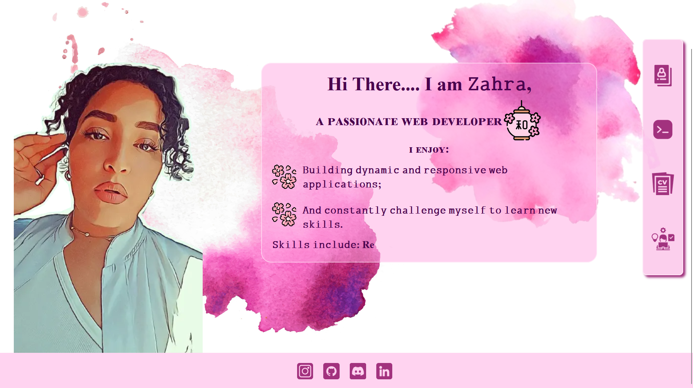

</img>
 ### 𝚃𝚑𝚒𝚜 𝚙𝚛𝚘𝚓𝚎𝚌𝚝 𝚜𝚑𝚘𝚠𝚌𝚊𝚜𝚎𝚜 𝚖𝚢 𝚜𝚔𝚒𝚕𝚕𝚜 𝚊𝚗𝚍 𝚙𝚛𝚘𝚓𝚎𝚌𝚝𝚜 𝚞𝚜𝚒𝚗𝚐 𝙽𝚎𝚡𝚝.𝚓𝚜 𝚊𝚗𝚍 𝚃𝚢𝚙𝚎𝚂𝚌𝚛𝚒𝚙𝚝.

# ɪɴᴛʀᴏᴅᴜᴄᴛɪᴏɴ                      

𝚃𝚑𝚒𝚜 𝚙𝚘𝚛𝚝𝚏𝚘𝚕𝚒𝚘 𝚒𝚜 𝚋𝚞𝚒𝚕𝚝 𝚞𝚜𝚒𝚗𝚐 𝙽𝚎𝚡𝚝.𝚓𝚜 𝚊𝚗𝚍 𝚃𝚢𝚙𝚎𝚂𝚌𝚛𝚒𝚙𝚝 𝚝𝚘 𝚙𝚛𝚘𝚟𝚒𝚍𝚎 𝚊 𝚏𝚊𝚜𝚝, 𝚜𝚌𝚊𝚕𝚊𝚋𝚕𝚎, 𝚊𝚗𝚍 𝚖𝚊𝚒𝚗𝚝𝚊𝚒𝚗𝚊𝚋𝚕𝚎 𝚠𝚎𝚋 𝚊𝚙𝚙𝚕𝚒𝚌𝚊𝚝𝚒𝚘𝚗. 𝙸𝚝 𝚒𝚗𝚌𝚕𝚞𝚍𝚎𝚜 𝚟𝚊𝚛𝚒𝚘𝚞𝚜 𝚜𝚎𝚌𝚝𝚒𝚘𝚗𝚜 𝚝𝚘 𝚑𝚒𝚐𝚑𝚕𝚒𝚐𝚑𝚝 𝚖𝚢 𝚜𝚔𝚒𝚕𝚕𝚜, 𝚙𝚛𝚘𝚓𝚎𝚌𝚝𝚜, 𝚊𝚗𝚍 𝚎𝚡𝚙𝚎𝚛𝚒𝚎𝚗𝚌𝚎𝚜.

# ꜰᴇᴀᴛᴜʀᴇꜱ 

* 𝚁𝚎𝚜𝚙𝚘𝚗𝚜𝚒𝚟𝚎 𝙳𝚎𝚜𝚒𝚐𝚗: 𝚃𝚑𝚎 𝚙𝚘𝚛𝚝𝚏𝚘𝚕𝚒𝚘 𝚒𝚜 𝚏𝚞𝚕𝚕𝚢 𝚛𝚎𝚜𝚙𝚘𝚗𝚜𝚒𝚟𝚎 𝚊𝚗𝚍 𝚠𝚘𝚛𝚔𝚜 𝚘𝚗 𝚊𝚕𝚕 𝚍𝚎𝚟𝚒𝚌𝚎𝚜.
* 𝙿𝚛𝚘𝚓𝚎𝚌𝚝𝚜 𝚂𝚑𝚘𝚠𝚌𝚊𝚜𝚎: 𝙰 𝚜𝚎𝚌𝚝𝚒𝚘𝚗 𝚝𝚘 𝚍𝚒𝚜𝚙𝚕𝚊𝚢 𝚖𝚢 𝚙𝚛𝚘𝚓𝚎𝚌𝚝𝚜 𝚠𝚒𝚝𝚑 𝚍𝚎𝚜𝚌𝚛𝚒𝚙𝚝𝚒𝚘𝚗𝚜 𝚊𝚗𝚍 𝚕𝚒𝚗𝚔𝚜. 
* 𝚂𝚔𝚒𝚕𝚕𝚜 𝚂𝚎𝚌𝚝𝚒𝚘𝚗: 𝙰 𝚕𝚒𝚜𝚝 𝚘𝚏 𝚖𝚢 𝚝𝚎𝚌𝚑𝚗𝚒𝚌𝚊𝚕 𝚜𝚔𝚒𝚕𝚕𝚜 𝚊𝚗𝚍 𝚙𝚛𝚘𝚏𝚒𝚌𝚒𝚎𝚗𝚌𝚒𝚎𝚜.
* 𝙲𝚘𝚗𝚝𝚊𝚌𝚝 𝙵𝚘𝚛𝚖: 𝙰 𝚏𝚘𝚛𝚖 𝚝𝚘 𝚊𝚕𝚕𝚘𝚠 𝚟𝚒𝚜𝚒𝚝𝚘𝚛𝚜 𝚝𝚘 𝚐𝚎𝚝 𝚒𝚗 𝚝𝚘𝚞𝚌𝚑 𝚠𝚒𝚝𝚑 𝚖𝚎.
* 𝙰𝚋𝚘𝚞𝚝 𝚂𝚎𝚌𝚝𝚒𝚘𝚗: 𝚊 𝚜𝚎𝚌𝚝𝚒𝚘𝚗 𝚠𝚑𝚎𝚛𝚎 𝚊 𝚜𝚑𝚘𝚠𝚌𝚊𝚜𝚎 𝚖𝚢 𝚏𝚊𝚟𝚘𝚛𝚒𝚝𝚎 𝚖𝚘𝚟𝚒𝚎𝚜, 𝚋𝚘𝚘𝚔𝚜 𝚎𝚝𝚌;
* 𝚁𝚎𝚜𝚞𝚖𝚎 𝚂𝚑𝚘𝚠𝚌𝚊𝚜𝚎: 𝙰 𝚜𝚎𝚌𝚝𝚒𝚘𝚗 𝚠𝚑𝚎𝚛𝚎 𝚞 𝚌𝚊𝚗 𝚜𝚎𝚎 𝚊 𝚙𝚛𝚎𝚟𝚒𝚎𝚠 𝚘𝚏 𝚖𝚢 𝚛𝚎𝚜𝚞𝚖𝚎 𝚊𝚗𝚍 𝚊𝚕𝚜𝚘 𝚋𝚎 𝚊𝚋𝚕𝚎 𝚝𝚘 𝚍𝚘𝚠𝚗𝚕𝚘𝚊𝚍 𝚒𝚝;

#  ᴜꜱᴇᴅ ᴛᴇᴄʜ

𝙽𝚎𝚡𝚝.𝚓𝚜: 𝙰 𝚁𝚎𝚊𝚌𝚝 𝚏𝚛𝚊𝚖𝚎𝚠𝚘𝚛𝚔 𝚏𝚘𝚛 𝚜𝚎𝚛𝚟𝚎𝚛-𝚜𝚒𝚍𝚎 𝚛𝚎𝚗𝚍𝚎𝚛𝚒𝚗𝚐 𝚊𝚗𝚍 𝚜𝚝𝚊𝚝𝚒𝚌 𝚜𝚒𝚝𝚎 𝚐𝚎𝚗𝚎𝚛𝚊𝚝𝚒𝚘𝚗. 
   

𝚃𝚢𝚙𝚎𝚂𝚌𝚛𝚒𝚙𝚝: 𝙰 𝚜𝚝𝚊𝚝𝚒𝚌𝚊𝚕𝚕𝚢 𝚝𝚢𝚙𝚎𝚍 𝚜𝚞𝚙𝚎𝚛𝚜𝚎𝚝 𝚘𝚏 𝙹𝚊𝚟𝚊𝚂𝚌𝚛𝚒𝚙𝚝. 
    

𝚃𝚊𝚒𝚕𝚠𝚒𝚗𝚍 𝙲𝚂𝚂: 𝙵𝚘𝚛 𝚜𝚝𝚢𝚕𝚒𝚗𝚐 𝚝𝚑𝚎 𝚌𝚘𝚖𝚙𝚘𝚗𝚎𝚗𝚝𝚜. 
    
    
𝙵𝚛𝚊𝚖𝚎𝚛 𝙼𝚘𝚝𝚒𝚘𝚗: 𝙵𝚘𝚛 𝚊𝚗𝚒𝚖𝚊𝚝𝚒𝚘𝚗𝚜 𝚊𝚗𝚍 𝚝𝚛𝚊𝚗𝚜𝚒𝚝𝚒𝚘𝚗𝚜. 
  
  

𝚅𝚎𝚛𝚌𝚎𝚕: 𝙵𝚘𝚛 𝚍𝚎𝚙𝚕𝚘𝚢𝚖𝚎𝚗𝚝.
  

# ꜱᴄʀᴇᴇɴꜱʜᴏᴛ
</img>

ꜰᴇᴇʟ ꜰʀᴇᴇ ᴛᴏ ɢɪᴠᴇ ᴍᴇ ᴀ ꜰᴇᴇᴅʙᴀᴄᴋ!

